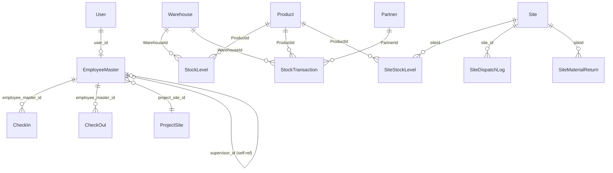

# ERP Backend — Full Codebase Research

> **Generated:** 2026-07-29  
> **Project:** `erp-backend-solid-principle`  
> **Stack:** Node.js 22+ · Express 5 · MySQL · Sequelize 6 · Zod 4 · JWT · bcrypt  
> **Architecture:** Modular Monolith — `route → validate → controller → service → repository → model`

---

## Table of Contents

- [1. Project Overview](#1-project-overview)
- [2. Directory Tree](#2-directory-tree)
- [3. Common / Shared Layer](#3-common--shared-layer)
- [4. Auth Module](#4-auth-module)
- [5. HRM Module](#5-hrm-module)
- [6. Inventory Module](#6-inventory-module)
- [7. Sales Module](#7-sales-module)
- [8. Migration Scripts](#8-migration-scripts)
- [9. Project-Level Files](#9-project-level-files)
- [10. Database Schema & Relationships](#10-database-schema--relationships)
- [11. API Surface](#11-api-surface)
- [12. Design Patterns & Architecture](#12-design-patterns--architecture)
- [13. Security Posture](#13-security-posture)
- [14. Known Issues & Technical Debt](#14-known-issues--technical-debt)

---

## 1. Project Overview

A modular ERP backend organized as a **modular monolith**. Each business domain lives in its own module under `src/modules/` with a layered architecture and per-module **Dependency Injection composition roots**.

### Key Capabilities

| Domain    | Features |
|-----------|----------|
| **Auth**  | JWT login, RBAC (9 roles), token blacklisting, internal API key validation |
| **HRM**   | Employee master, geofenced attendance (Haversine + OSM), team hierarchy, payroll, Excel export |
| **Inventory** | Products (multi-UOM), warehouses, partners, stock movements with row-level locking, site dispatch ledger, material returns, stock reconciliation |
| **Sales** | Lead model (WIP — model only, no routes/services) |

### Dependencies (`package.json`)

```
express@5.2.1    sequelize@6.37.8    mysql2@3.23.1     jsonwebtoken@9.0.3
bcrypt@6.0.0     zod@4.4.3           helmet@8.3.0      cors@2.8.6
dotenv@17.4.2    node-cache@5.1.2    exceljs@4.4.0     pdfkit@0.17.2
moment-timezone  axios@1.13.4        uuid@14.0.1       glob@13.0.6
nodemon@3.1.14 (dev)
```

---

## 2. Directory Tree

```
erp-backend-solid-principle/
├── .claude/                          # AI context files
├── .env                              # Environment config (13 vars)
├── .gitignore                        # node_modules
├── API_DOCUMENTATION.md              # 46 documented endpoints
├── CHANGES.md                        # Change log & migration notes
├── README.md                         # Project overview
├── package.json                      # Node ≥22, npm ≥11
├── backups/                          # DB dumps
│   ├── prod_..._20260722.sql
│   └── last_dump.err
├── scripts/                          # 9 migration/diagnostic scripts
│   ├── diagnose-geofence.js
│   ├── migrate-dispatch-ledger.js
│   ├── migrate-dual-uom-transactions.js
│   ├── migrate-inventory-sites-columns.js
│   ├── migrate-multi-uom.js
│   ├── migrate-projectsite-and-vehicle.js
│   ├── migrate-site-project-name.js
│   ├── sync-site-tables.js
│   └── sync-stock.js
└── src/
    ├── app.js                        # Express app setup, CORS, error handling
    ├── server.js                     # Entry point, DB init
    ├── common/                       # Shared infrastructure
    │   ├── AppError.js               # Operational error class
    │   ├── BaseRepository.js         # Generic Sequelize DAO
    │   ├── asyncHandler.js           # Promise error wrapper
    │   ├── db.config.js              # Sequelize connection (IST timezone)
    │   ├── index.db.js               # Model registry & associations
    │   └── validate.js               # Zod middleware factory
    └── modules/
        ├── auth/
        │   ├── auth.module.js        # DI composition root
        │   ├── controllers/          # auth.controller.js, user.controller.js
        │   ├── middleware/           # authMiddleware.js, api.internalAuth.js
        │   ├── models/              # user.model.js
        │   ├── repositories/        # user.repository.js
        │   ├── routes/              # auth.route.js, user.route.js
        │   ├── services/            # auth.service.js, user.service.js
        │   └── validators/          # auth.validator.js
        ├── hrm/
        │   ├── hrm.module.js         # DI composition root
        │   ├── ATTENDANCE_MODULE_README.md
        │   ├── controllers/          # attendance, employee, export, projectSite
        │   ├── models/              # CheckIn, CheckOut, EmployeeMaster, ProjectSite
        │   ├── repositories/        # checkIn, checkOut, employee, projectSite
        │   ├── routes/              # attendance, employee, export, projectSite
        │   ├── services/            # attendance, employee, export, payroll, projectSite
        │   ├── templates/           # attendance_template.xlsx
        │   ├── utils/               # geo.js, osm.js, time.js
        │   └── validators/          # attendance, employee, projectSite
        ├── inventory/
        │   ├── inventory.module.js   # DI composition root
        │   ├── Route/               # inventory, dispatch, site routes
        │   ├── inventory_controller/ # 8 controller files
        │   ├── model/               # 9 Sequelize models
        │   ├── repositories/        # siteDispatchLog, siteStock
        │   ├── services/            # dispatch, reconcile, site, uom
        │   └── validators/          # inventory.validator.js
        └── sales/
            └── model/               # lead.model.js (WIP)
```

---

## 3. Common / Shared Layer

### `AppError.js`
- Custom `Error` subclass carrying `statusCode`, `status`, and `isOperational = true` flag
- Used across all modules for domain-level error propagation
- `Error.captureStackTrace` for clean stack traces

### `BaseRepository.js`
- Generic DAO wrapping a Sequelize model via constructor injection
- **Methods:** `findById`, `findOne`, `findAll`, `findAndCountAll`, `findOrCreate`, `create`, `bulkCreate`, `update`, `destroy`, `count`, `sum`
- Passes through Sequelize options (`transaction`, `include`, `attributes`, `lock`, etc.)
- Implements **Dependency Inversion Principle** — services depend on repository interface, not Sequelize directly

### `asyncHandler.js`
- HOF wrapping async Express handlers: `(fn) => (req, res, next) => Promise.resolve(fn(...)).catch(next)`
- Eliminates repetitive try/catch boilerplate in routes

### `db.config.js`
- Loads `.env` via absolute path resolution (`path.resolve(__dirname, '../../.env')`)
- Creates Sequelize instance targeting MySQL with timezone `+05:30` (IST)
- `dateStrings: true`, `typeCast: true`, `logging: false`

### `index.db.js` — Central Model Registry
- Imports all 14 models across auth, hrm, inventory modules
- Defines all cross-module associations (foreign keys, relationships)
- Exports consolidated `db` object: `{ sequelize, Sequelize, User, EmployeeMaster, CheckIn, CheckOut, ProjectSite, Product, Warehouse, StockLevel, StockTransaction, Partner, Site, SiteStockLevel, SiteMaterialReturn, SiteDispatchLog }`

### `validate.js`
- Express middleware factory: `validate(zodSchema, options)` 
- Validates `req.body` (default), `req.query`, or `req.params`
- Returns first Zod error issue; supports `{ withSuccess: true }` response envelope
- Re-assigns parsed/validated data back to `req[source]`

---

## 4. Auth Module

### Composition Root — `auth.module.js`
Wires the full dependency graph:
```
db.User → UserRepository → AuthService / UserService → AuthController / UserController
db.EmployeeMaster → BaseRepository (employeeRepository) → AuthService
myCache (NodeCache) → AuthService / UserService
process.env.JWT_SECRET → AuthService
```
**Exports:** `{ authController, userController }`

---

### Models

#### `user.model.js` — `User` table
| Column | Type | Notes |
|--------|------|-------|
| `id` | UUID | PK, auto-generated |
| `name` | STRING | required |
| `email` | STRING | unique |
| `username` | STRING | unique |
| `password` | STRING | auto-hashed via bcrypt hooks |
| `role` | ENUM | 9 roles (see below) |

**Roles:** `ADMIN`, `ACCOUNTS`, `HR`, `FACTORY_MANAGER`, `INVENTORY_MANAGER`, `SALES`, `EMPLOYEE`, `Technical-Supervisor`, `Technical-Team`

**Hooks:** `beforeCreate` / `beforeUpdate` → `bcrypt.hash(password, 10)`  
**Instance Method:** `validPassword(password)` → `bcrypt.compare()`

---

### Repositories

#### `user.repository.js` (extends `BaseRepository`)
- `findByEmail(email, options)`
- `findByEmailOrUsername(email, username, options)` — uses `Op.or`

---

### Services

#### `auth.service.js` — `AuthService`
- **`login(email, password)`**: Core authentication flow
  1. Finds user by email (includes role)
  2. Validates password via `bcrypt.compare`
  3. Auto-links orphaned `EmployeeMaster` records by matching email
  4. Fetches supervisor's team members (if supervisor role)
  5. Generates 30-day JWT: `{ id, role, employeeId }`
  6. Caches token: `auth_token:${userId}` with 30-day TTL
  7. Returns `{ token, user }` with IST-formatted `loginTime`

#### `user.service.js` — `UserService`
- **`register({ name, email, username, password, role })`** — duplicate check via `findByEmailOrUsername`
- **`getProfile(userId)`** — fetches user excluding password
- **`changePassword(userId, oldPassword, newPassword)`** — validates old, hashes new
- **`updateProfile(userId, { name, email })`** — restricts to name/email only (prevents role escalation)
- **`logout(token)`** — decodes JWT, calculates remaining TTL, blacklists via `myCache.set('blacklist:${token}', true, remainingTTL)`

---

### Middleware

#### `authMiddleware.js`
- **`verifyToken`**: Extracts Bearer token → `jwt.verify` → checks blacklist in `myCache` → attaches `req.user`
- **`authorizeRoles(...roles)`**: HOF checking `req.user.role` against allowed roles (case-insensitive)
- **`myCache`**: Shared `NodeCache` singleton (exported for DI)
- **Fail-fast:** Throws immediately if `JWT_SECRET` is missing on module load

#### `api.internalAuth.js`
- Validates `x-internal-key` header against `INTERNAL_API_KEY_HASH` env var
- Uses `crypto.createHash('sha256')` + `crypto.timingSafeEqual` (timing-attack safe)

---

### Validators — `auth.validator.js`
| Schema | Fields |
|--------|--------|
| `loginSchema` | `email` (email format), `password` (non-empty) |
| `registerSchema` | `name`, `email`, `username`, `password`, `role` |
| `changePasswordSchema` | `oldPassword`, `newPassword` |
| `updateProfileSchema` | `name`, `email` |

All schemas use `.loose()` (allows extra fields).

---

### Routes

| Method | Path | Middleware | Handler |
|--------|------|------------|---------|
| `POST` | `/v1/api/auth/login` | `validate(loginSchema, {withSuccess})` | `authController.login` |
| `POST` | `/v2/api/user/register` | `validate(registerSchema)` | `userController.Registration` |
| `GET` | `/v2/api/user/profile` | `verifyToken` | `userController.Profile` |
| `PUT` | `/v2/api/user/change-password` | `verifyToken`, `validate(changePasswordSchema)` | `userController.ChangePassword` |
| `PUT` | `/v2/api/user/update-profile/:id` | `verifyToken`, `validate(updateProfileSchema)` | `userController.updateProfile` |
| `POST` | `/v2/api/user/logout` | `verifyToken` | `userController.logout` |

---

## 5. HRM Module

### Composition Root — `hrm.module.js`
Wires:
```
db.EmployeeMaster → EmployeeRepository → EmployeeService → EmployeeController
db.CheckIn → CheckInRepository ─┐
db.CheckOut → CheckOutRepository ─┤→ AttendanceService → AttendanceController
db.ProjectSite → ProjectSiteRepository ─┤→ ProjectSiteService → ProjectSiteController
                                         └→ PayrollService ─┐
                                                            └→ AttendanceController (payroll)
                                         └→ ExportService → ExportController
```
**Exports:** `{ employeeController, attendanceController, projectSiteController, exportController }`

---

### Models

#### `EmployeeMaster.js` — `hrm_employee_master`
| Column | Type | Notes |
|--------|------|-------|
| `id` | UUID | PK |
| `user_id` | UUID | FK → User (nullable, linked on first login) |
| `name`, `email`, `phone`, `position` | STRING | |
| `basic_salary` | DECIMAL(10,2) | |
| `supervisor_id` | UUID | Self-referencing FK → EmployeeMaster |
| `project_site_id` | UUID | FK → ProjectSite |

#### `CheckIn_model.js` — `hrm_checkins`
| Column | Type | Notes |
|--------|------|-------|
| `id` | UUID | PK |
| `employee_master_id` | UUID | FK → EmployeeMaster |
| `timestamp` | DATE | |
| `latitude`, `longitude` | DECIMAL | Location |
| `address` | STRING | Reverse geocoded |
| `marked_by` | STRING | Who initiated |

#### `CheckOut_model.js` — `hrm_checkouts`
Same as CheckIn plus `working_hours` (DECIMAL 5,2).

#### `ProjectSite_model.js` — `ProjectSite`
| Column | Type | Notes |
|--------|------|-------|
| `id` | UUID | PK |
| `locationName` | STRING | Display name |
| `latitude`, `longitude` | DECIMAL | Geofence center |
| `radiusInMeters` | INTEGER | Default 100m |

---

### Repositories

| Repository | Model | Extra Methods |
|------------|-------|---------------|
| `EmployeeRepository` | EmployeeMaster | `findByUserId`, `findByPhone`, `findTeam`, `findByEmailOrUserId` |
| `CheckInRepository` | CheckIn | (inherits BaseRepository) |
| `CheckOutRepository` | CheckOut | (inherits BaseRepository) |
| `ProjectSiteRepository` | ProjectSite | (inherits BaseRepository) |

---

### Services

#### `attendance.service.js` — `AttendanceService` (15,910 bytes — largest HRM file)
- **`checkIn(employeeId, { latitude, longitude })`**
  - Fetches all ProjectSites → `findMatchingSite()` (Haversine geofence)
  - Exempts Sales/Driver positions from geofence check
  - Calls `getAddressFromOSM()` for reverse geocoding
  - Prevents duplicate check-ins on same IST day
- **`checkOut(employeeId, { latitude, longitude })`**
  - Calculates `working_hours` from check-in timestamp
  - Records check-out with location data
- **`getTeamMembers(supervisorId)`** — Recursive team tree
- **`getAttendanceData / getAllAttendanceData / getFilteredAttendance`** — Date-range queries with IST boundary helpers

#### `employee.service.js` — `EmployeeService`
- **`createEmployee / bulkCreateEmployees`** — Atomic transaction across `User` + `EmployeeMaster` tables
- **`updateEmployee`** — Updates employee and synced user record
- **`getAllEmployees`** — Includes associated User and ProjectSite
- **`getEmployeeProfile`** — Full profile with supervisor chain

#### `payroll.service.js` — `PayrollService`
- **`getMonthlyPayroll(employeeId, month, year)`**
  - Counts working days (excluding weekends) in month
  - Computes payable amount: `(basicSalary / totalWorkingDays) * presentDays`

#### `export.service.js` — `ExportService`
- **`buildMonthlyAttendanceWorkbook(month, year)`**
  - Loads `attendance_template.xlsx` via ExcelJS
  - Populates cells programmatically with attendance data
  - Maintains template styling (borders, alignment)

#### `projectSite.service.js` — `ProjectSiteService`
- CRUD for geofence locations with lat/lon validation (-90/90, -180/180)

---

### Utils

#### `geo.js` — Geospatial
- **`getDistance(lat1, lon1, lat2, lon2)`** — Haversine formula returning meters
- **`findMatchingSite(sites, latitude, longitude)`** — Returns first site within its `radiusInMeters`
- `parseFloat()` on inputs to handle Sequelize DECIMAL string returns

#### `osm.js` — Reverse Geocoding
- **`getAddressFromOSM(lat, lon)`** — Nominatim API with 5s timeout
- Graceful fallback: returns raw coordinates if API fails

#### `time.js` — IST Timezone Helpers
- `TZ = 'Asia/Kolkata'`
- `startOfTodayIST()`, `startOfDayIST(d)`, `endOfDayIST(d)`, `startOfMonthIST()`, `endOfMonthIST()`
- Prevents UTC vs IST date boundary bugs in queries

---

### Validators

| Schema | Fields |
|--------|--------|
| `checkinSchema` | `latitude` (coerce number), `longitude` (coerce number) |
| `checkoutSchema` | `latitude` (coerce number), `longitude` (coerce number) |
| `createEmployeeSchema` | `name`, `email`, `phone`, `position` + optional fields |
| `bulkCreateEmployeesSchema` | `employees[]` array |
| `createProjectSiteSchema` | `locationName`, `latitude`, `longitude` |

---

### Routes

| Method | Path | Auth | Handler |
|--------|------|------|---------|
| `POST` | `/v2/api/attendance/checkin` | `verifyToken` | `attendanceController.handleCheckIn` |
| `POST` | `/v2/api/attendance/checkout` | `verifyToken` | `attendanceController.handleCheckOut` |
| `GET` | `/v2/api/attendance/team-members` | `verifyToken` | `attendanceController.getTeamMembers` |
| `GET` | `/v2/api/attendance/attandace-data` | `verifyToken` | `attendanceController.getAttendanceData` |
| `GET` | `/v2/api/attendance/filtered-attendance` | `verifyToken` | `attendanceController.getFilteredAttendance` |
| `GET` | `/v2/api/attendance/full-attendance-report` | `verifyToken` | `attendanceController.getAllAttendanceData` |
| `GET` | `/v2/api/attendance/monthly-payroll-report` | `verifyToken` | `attendanceController.getMonthlyPayrollReport` |
| `POST` | `/v2/api/employee/create-employee` | `verifyToken`, `authorizeRoles(ADMIN, HR)` | `employeeController.CreateEmployee` |
| `POST` | `/v2/api/employee/create-bulk-employee` | `verifyToken`, `authorizeRoles(ADMIN, HR)` | `employeeController.bulkCreateEmployees` |
| `PUT` | `/v2/api/employee/update-employee/:id` | `verifyToken`, `authorizeRoles(ADMIN, HR)` | `employeeController.updateEmployee` |
| `GET` | `/v2/api/employee/get-all-employees` | `verifyToken` | `employeeController.getallEmployee` |
| `GET` | `/v2/api/employee/get-user-profile` | `verifyToken` | `employeeController.getEmployeeProfile` |
| `POST` | `/v2/api/project-site/create-project-site` | `verifyToken`, `authorizeRoles(ADMIN, HR, INV_MGR)` | `projectSiteController.createProjectSite` |
| `PUT` | `/v2/api/project-site/update-project-site/:id` | `verifyToken`, `authorizeRoles(ADMIN, HR)` | `projectSiteController.updateProjectSite` |
| `GET` | `/v2/api/project-site/get-all-project-sites` | `verifyToken` | `projectSiteController.getAllProjectSites` |
| `DELETE` | `/v2/api/project-site/delete-project-site/:id` | `verifyToken`, `authorizeRoles(ADMIN, HR)` | `projectSiteController.deleteProjectSite` |
| `GET` | `/v2/api/export/export-monthly` | `verifyToken` | `exportController.exportAttendanceWithTemplate` |

---

## 6. Inventory Module

### Composition Root — `inventory.module.js`
Wires (for new class-based controllers):
```
db.SiteDispatchLog → SiteDispatchLogRepository ─┐
db.SiteStockLevel → SiteStockRepository ─────────┤→ DispatchService → DispatchController
                                                  └→ SiteService → SiteController
db.Site, db.ProjectSite injected into services
```
**Exports:** `{ dispatchController, siteController }`

> **Note:** Legacy procedural controllers (`inventory.controller.js`, `product.controller.js`, `warehouse.controller.js`, `Partner.js`, `siteReturn.controller.js`, `reconcile.controller.js`) are imported directly in `inventory.route.js` and **bypass** the composition root.

---

### Models (9 Sequelize models)

#### `Product.js` — `inventory_products`
| Column | Type | Notes |
|--------|------|-------|
| `id` | UUID | PK |
| `sku_code` | STRING | unique |
| `name` | STRING | unique |
| `base_uom` | STRING | default `"pcs"` |
| `purchase_uom` | STRING | nullable |
| `conversion_factor` | DECIMAL(10,3) | 1 purchase_uom = N base_uom |
| `total_stock` | DECIMAL(14,3) | Running counter in base UOM |
| `paranoid` | — | Soft deletes enabled |

#### `Warehouse.js` — `inventory_warehouses`
| Column | Type | Notes |
|--------|------|-------|
| `id` | UUID | PK |
| `name` | STRING | |
| `location` | STRING | |
| `type` | ENUM | `MAIN`, `RAW_MATERIAL`, `FINISHED_GOODS`, `SCRAP`, `QC_AREA` |
| `is_active` | BOOLEAN | default true |
| `paranoid` | — | Soft deletes |

#### `Partner.js` — `inventory_partners`
| Column | Type | Notes |
|--------|------|-------|
| `id` | UUID | PK |
| `name`, `contact_person`, `phone`, `email` | STRING | |
| `type` | ENUM | `SUPPLIER`, `MANUFACTURER`, `CUSTOMER`, `TRADER` |
| `gst_number` | STRING | unique |
| `is_active` | BOOLEAN | |
| `paranoid` | — | Soft deletes |

#### `StockTransaction.js` — `inventory_transactions`
| Column | Type | Notes |
|--------|------|-------|
| `id` | UUID | PK |
| `type` | ENUM | `INWARD`, `OUTWARD`, `RETURN`, `DAMAGE`, `ADJUSTMENT`, `SCRAP`, `DISPATCH` |
| `quantity` | DECIMAL(14,3) | Entered quantity |
| `uom` | STRING | Unit used at entry |
| `conversion_factor` | DECIMAL(10,3) | |
| `base_quantity` | DECIMAL(14,3) | Calculated (`quantity × factor`) |
| `status` | ENUM | `PENDING`, `COMPLETED`, `CANCELLED` |
| `ProductId`, `WarehouseId`, `PartnerId` | UUID | FKs |
| `manufacturer_id`, `color` | STRING | Variant attributes |
| `vehicle_number`, `challan_number`, `remarks` | STRING | Logistics |
| `site_id` | UUID | For DISPATCH type |
| `paranoid` | — | Soft deletes (`deletedAt` mapped) |

**Custom Validator:** `partnerRequired` — requires PartnerId for INWARD/OUTWARD types.

#### `StockLevel.js` — `inventory_stock_levels`
| Column | Type | Notes |
|--------|------|-------|
| `ProductId`, `WarehouseId` | UUID | Compound FK |
| `manufacturer_id`, `color` | STRING | Variant key |
| `current_quantity`, `reserved_quantity` | DECIMAL(14,3) | |
| Unique index | — | `(ProductId, WarehouseId, manufacturer_id, color)` |

#### `Site.js` — `inventory_sites`
| Column | Type | Notes |
|--------|------|-------|
| `id` | UUID | PK |
| `project_name`, `site_name` | STRING | non-null |
| `manager_name`, `contact_number`, `site_location` | STRING | |
| `paranoid` | — | Soft deletes |

#### `SiteStockLevel.js` — `inventory_site_stock_levels`
| Column | Type | Notes |
|--------|------|-------|
| `siteId`, `ProductId` | UUID | FKs |
| `manufacturer_id`, `color` | STRING | Variant key |
| `inHandQty` | DECIMAL(14,3) | Live balance |
| Unique index | — | `(siteId, ProductId, manufacturer_id, color)` |

#### `SiteDispatchLog.js` — `inventory_site_dispatch_logs`
| Column | Type | Notes |
|--------|------|-------|
| `id` | UUID | PK |
| `site_id`, `item_id` | UUID | FKs |
| `transaction_type` | ENUM | `DISPATCH`, `RETURN` |
| `quantity` | DECIMAL(14,3) | Entered |
| `base_quantity` | DECIMAL(14,3) | Calculated |
| `uom`, `conversion_factor` | — | UOM context |
| `transaction_date` | DATEONLY | |
| `remarks`, `challan_number`, `vehicle_number` | STRING | |
| Append-only | — | No updates/deletes |

#### `SiteMaterialReturn.js` — `inventory_site_material_returns`
| Column | Type | Notes |
|--------|------|-------|
| `siteId`, `ProductId`, `WarehouseId` | UUID | FKs |
| `returnQty` | DECIMAL(14,3) | |
| `condition` | ENUM | `Good`, `Damaged`, `Scrap` |
| `manufacturer_id`, `color` | STRING | Variant attributes |

---

### Repositories

#### `siteDispatchLog.repository.js` (extends `BaseRepository`)
- `getConsumptionBySite(siteId, filters)` — Grouped aggregation using `SUM(CASE WHEN ...)` to compute net consumption in base UOM per item
- Includes Product join for display names

#### `siteStock.repository.js` (extends `BaseRepository`)
- `findForUpdate(where, transaction)` — `SELECT FOR UPDATE` row-level lock
- `findWithNormalizedKey(where, transaction)` — Variant key normalization
- `findAllForProductForUpdate(where, transaction)` — Greedy bucket draining

---

### Services

#### `dispatch.service.js` — `DispatchService` (18,757 bytes — largest file)
- **`dispatchItem(dto)`**: Deducts from warehouse `StockLevel`, creates `SiteStockLevel` entry, logs to `SiteDispatchLog`, updates `Product.total_stock` — all in managed transaction with `LOCK.UPDATE`
- **`returnItem(dto)`**: Reverse of dispatch — moves stock from site back to warehouse
- **`getConsumptionReport(siteId, filters)`**: Net consumption via repository aggregation
- **`getSiteStock(siteId)`**: Live site balances with product details
- Normalizes all inputs to base UOM via `uomService`

#### `reconcile.service.js` — Stock Reconciliation Engine
- **`reconcileStock({ dryRun, syncProductTotal })`**: 
  1. Recomputes expected stock from `inventory_transactions` (COMPLETED + non-deleted)
  2. Groups by `(ProductId, WarehouseId, manufacturer_id)`
  3. Resets `StockLevel` records
  4. Optionally syncs `Product.total_stock`
  5. Supports `dryRun: true` mode (rollback at end)
- Helper: `round3(n)` — 3-decimal precision rounding

#### `site.service.js` — `SiteService`
- **`createSite(dto)`**: Atomically creates in both `inventory_sites` AND `HRM ProjectSite` (geofence) within single transaction
- CRUD for site master data with coordinate validation

#### `uom.service.js` — UOM Conversion Utility
- **`round3(n)`** — Prevents binary float desync
- **`uomMatches(entered, base, purchase)`** — Case-insensitive UOM matching
- **`toBaseQuantity(qty, enteredUom, product)`** — Converts to base UOM using conversion factor
- **`formatDualStock(baseQty, product)`** — UI-ready strings like `"4 Bundle & 45 mtr (445 mtr Total)"`

---

### Controllers (8 files)

| Controller | Style | Purpose |
|------------|-------|---------|
| `dispatch.controller.js` | Class-based (DI) | Site dispatch ledger CRUD |
| `site.controller.js` | Class-based (DI) | Site master data CRUD |
| `inventory.controller.js` | Procedural (legacy) | Stock movements, dashboard, transactions (~43KB, ~1263 lines) |
| `product.controller.js` | Procedural | Product CRUD, multi-UOM, safety checks |
| `warehouse.controller.js` | Procedural | Warehouse CRUD |
| `Partner.js` | Procedural | Partner/supplier CRUD |
| `siteReturn.controller.js` | Procedural | Material return from site → warehouse (5 DB writes in transaction) |
| `reconcile.controller.js` | Procedural | Stock reconciliation trigger |

---

### Validators — `inventory.validator.js`

| Schema | Key Fields |
|--------|------------|
| `createProductSchema` | `sku_code`, `name`, optional UOM fields |
| `bulkCreateProductsSchema` | `products[]` array |
| `createWarehouseSchema` | `name` |
| `createPartnerSchema` | `name`, `type` |
| `createMovementSchema` | `type`, `ProductId`, `WarehouseId`, `quantity` |
| `bulkMovementSchema` | `movements[]` array |
| `siteReturnSchema` | `siteId`, `ProductId`, `WarehouseId`, `returnQty` |
| `createSiteSchema` | `site_name`, `latitude`, `longitude` |
| `dispatchLedgerSchema` | `site_id`, `item_id`, `quantity`, `uom` |

---

### Routes

| Method | Path | Auth | Handler |
|--------|------|------|---------|
| `POST` | `/v2/api/inventory/products` | `verifyToken`, `canManage` | `createProduct` |
| `POST` | `/v2/api/inventory/products/bulk` | `verifyToken`, `canManage` | `bulkCreateProducts` |
| `GET` | `/v2/api/inventory/products` | `verifyToken` | `getAllProducts` |
| `PUT` | `/v2/api/inventory/products/:id` | `verifyToken`, `canManage` | `updateProduct` |
| `PATCH` | `/v2/api/inventory/products/:id/toggle-status` | `verifyToken`, `canManage` | `toggleProductStatus` |
| `POST` | `/v2/api/inventory/movements` | `verifyToken`, `canManage` | `processStockMovement` |
| `POST` | `/v2/api/inventory/movements/bulk` | `verifyToken`, `canManage` | `bulkProcessStockMovement` |
| `PUT` | `/v2/api/inventory/movements/:id` | `verifyToken`, `canManage` | `updateStockMovement` |
| `DELETE` | `/v2/api/inventory/movements/:id` | `verifyToken`, `canManage` | `deleteStockMovement` |
| `GET` | `/v2/api/inventory/dashboard` | `verifyToken` | `getInventoryDashboard` |
| `GET` | `/v2/api/inventory/stock` | `verifyToken` | `getAvailableStock` |
| `GET` | `/v2/api/inventory/transactions` | `verifyToken` | `getTransactionHistory` |
| `POST` | `/v2/api/inventory/warehouses` | `verifyToken`, `canManage` | `createWarehouse` |
| `GET` | `/v2/api/inventory/warehouses` | `verifyToken` | `getWarehouses` |
| `PUT` | `/v2/api/inventory/warehouses/:id` | `verifyToken`, `canManage` | `updateWarehouse` |
| `PATCH` | `/v2/api/inventory/warehouses/:id/toggle-status` | `verifyToken`, `canManage` | `toggleWarehouseStatus` |
| `POST` | `/v2/api/inventory/partners` | `verifyToken`, `canManage` | `createPartner` |
| `GET` | `/v2/api/inventory/partners` | `verifyToken` | `getPartners` |
| `PUT` | `/v2/api/inventory/partners/:id` | `verifyToken`, `canManage` | `updatePartner` |
| `PATCH` | `/v2/api/inventory/partners/:id/toggle-status` | `verifyToken`, `canManage` | `togglePartnerStatus` |
| `POST` | `/v2/api/inventory/site-return` | `verifyToken`, `canManage` | `returnMaterialFromSite` |
| `POST` | `/v2/api/inventory/reconcile-stock` | `verifyToken`, `authorizeRoles(ADMIN)` | `runStockReconciliation` |
| `POST` | `/v2/api/inventory/ledger/dispatch` | `verifyToken`, `canManage` | `dispatchController.dispatchItem` |
| `POST` | `/v2/api/inventory/ledger/return` | `verifyToken`, `canManage` | `dispatchController.returnItem` |
| `GET` | `/v2/api/inventory/ledger/consumption/:siteId` | `verifyToken` | `dispatchController.getConsumptionReport` |
| `GET` | `/v2/api/inventory/ledger/site-stock/:siteId` | `verifyToken` | `dispatchController.getSiteStock` |
| `POST` | `/v2/api/inventory/site/create` | `verifyToken`, `canManage` | `siteController.create` |
| `GET` | `/v2/api/inventory/site/` | `verifyToken` | `siteController.getAll` |
| `GET` | `/v2/api/inventory/site/:id` | `verifyToken` | `siteController.getById` |
| `PUT` | `/v2/api/inventory/site/update/:id` | `verifyToken`, `canManage` | `siteController.update` |
| `DELETE` | `/v2/api/inventory/site/delete/:id` | `verifyToken`, `canManage` | `siteController.remove` |

`canManage` = `authorizeRoles('ADMIN', 'INVENTORY_MANAGER', 'FACTORY_MANAGER')`

---

## 7. Sales Module

### `lead.model.js` — `Lead` (WIP)
| Column | Type |
|--------|------|
| `id` | UUID |
| `leadId` | STRING (unique) |
| `assignedTo` | STRING |
| `name` | STRING |
| `contactNumber` | STRING (unique) |
| `email` | STRING (unique) |

> **Status:** Model-only — no routes, services, controllers, or validators exist yet.

---

## 8. Migration Scripts

| Script | Purpose |
|--------|---------|
| `diagnose-geofence.js` | CLI diagnostic — verifies geofence table states |
| `migrate-dispatch-ledger.js` | Adds `total_stock` column to products, syncs dispatch logs table |
| `migrate-dual-uom-transactions.js` | Adds dual-UOM columns + `deletedAt` to transactions, widens ENUM |
| `migrate-inventory-sites-columns.js` | Adds missing site columns, copies legacy data |
| `migrate-multi-uom.js` | Adds multi-UOM fields to products + dispatch logs |
| `migrate-projectsite-and-vehicle.js` | Renames OfficeLocation → ProjectSite, adds vehicle_number |
| `migrate-site-project-name.js` | Adds denormalized `project_name` to sites |
| `sync-site-tables.js` | Syncs site management models with `{ alter: true }` |
| `sync-stock.js` | CLI stock reconciliation (`--dry-run`, `--no-product-total`, `--json`) |

---

## 9. Project-Level Files

### Environment Variables (`.env`)
| Variable | Purpose |
|----------|---------|
| `PORT` | HTTP port |
| `NODE_ENV` | Environment mode |
| `SYSTEM_IP` | Server bind address |
| `DB_HOST`, `DB_USER`, `DB_PASSWORD`, `DB_NAME`, `DB_DIALECT` | MySQL connection |
| `JWT_SECRET`, `JWT_EXPIRE` | Token signing |
| `INTERNAL_API_KEY` | Frontend-backend handshake |
| `CLIENT_URL`, `ALLOWED_ORIGINS` | CORS configuration |

### `.gitignore`
Only ignores `node_modules`.

---

## 10. Database Schema & Relationships



---

## 11. API Surface

| Base Path | Module | Endpoints |
|-----------|--------|-----------|
| `/v1/api/auth` | Auth | 1 (login) |
| `/v2/api/user` | Auth | 5 (register, profile, password, update, logout) |
| `/v2/api/employee` | HRM | 5 |
| `/v2/api/project-site` | HRM | 4 |
| `/v2/api/attendance` | HRM | 7 |
| `/v2/api/export` | HRM | 1 |
| `/v2/api/inventory` | Inventory | 22+ |
| `/v2/api/inventory/site` | Inventory | 5 |
| **Total** | — | **~50 endpoints** |

---

## 12. Design Patterns & Architecture

### SOLID Principles
- **SRP:** Clear separation — routes → validators → controllers → services → repositories → models
- **DIP:** Services accept repository instances via constructor injection
- **Composition Root:** Per-module `*.module.js` files wire all dependencies

### Patterns Used
| Pattern | Implementation |
|---------|----------------|
| Repository Pattern | `BaseRepository` wraps Sequelize models |
| Dependency Injection | Constructor injection in composition roots |
| Factory Pattern | `validate()` and `authorizeRoles()` middleware factories |
| Layered Architecture | 6-layer: route → validate → controller → service → repository → model |
| Soft Deletes | Sequelize `paranoid: true` across inventory models |
| Row-Level Locking | `LOCK.UPDATE` in stock mutations |
| Token Blacklisting | In-memory `NodeCache` for JWT invalidation on logout |

### Dual Architecture Style
- **New modules** (dispatch, site): Class-based DI with composition roots
- **Legacy modules** (products, warehouses, partners, stock movements): Procedural functions importing `db` directly

---

## 13. Security Posture

| Feature | Implementation |
|---------|----------------|
| Password Hashing | bcrypt (salt rounds 10) via Sequelize hooks |
| JWT Auth | 30-day tokens, Bearer scheme |
| Token Blacklisting | `NodeCache` blacklist on logout with calculated remaining TTL |
| RBAC | 9-role ENUM, `authorizeRoles()` middleware (case-insensitive) |
| Timing Attack Prevention | `crypto.timingSafeEqual` in internal API key validation |
| CORS | Whitelist-based origin validation from `ALLOWED_ORIGINS` env |
| Helmet | HTTP security headers via `helmet()` |
| Role Escalation Prevention | `updateProfile` restricts updates to `name` and `email` only |
| Input Validation | Zod schemas on all mutation endpoints |
| SQL Injection Prevention | Sequelize ORM parameterized queries |

---

## 14. Known Issues & Technical Debt

### Architecture
- [ ] **Dual controller styles:** Inventory has both class-based DI controllers (dispatch, site) and procedural legacy controllers (products, warehouses, etc.) — inconsistent
- [ ] **`inventory.controller.js` is monolithic:** ~43KB / ~1,263 lines — needs splitting
- [ ] **Overlapping product controllers:** `inventory.controller.js` and `product.controller.js` both export `createProduct`, `getAllProducts` etc.
- [ ] **Legacy controllers bypass DI:** Procedural controllers import `db` directly instead of receiving repositories

### Naming Inconsistencies
- [ ] Mixed PascalCase / camelCase in controller methods (`Registration` vs `updateProfile`)
- [ ] Endpoint typo: `/attandace-data` (preserved for API compat)
- [ ] Inconsistent directory naming: `Route/` (PascalCase) vs `routes/` (lowercase) across modules
- [ ] `inventory_controller/` vs `controllers/` naming mismatch between modules

### Data & Logic
- [ ] **In-memory token cache:** Token blacklist uses `NodeCache` — lost on restart (not clustered)
- [ ] **Site.projectId defined but Project model pending** (noted in `index.db.js`)
- [ ] **Sales module is WIP** — model only, no routes/services/controllers
- [ ] `.env` file committed to repo (`.gitignore` only excludes `node_modules`)

### Missing
- [ ] No automated tests (test script is just `echo "Error: no test specified"`)
- [ ] No request rate limiting
- [ ] No API versioning strategy beyond v1/v2 prefix
- [ ] No database migration framework (raw scripts in `/scripts/`)
- [ ] No logging framework (console.log/error only)
- [ ] `backups/` directory contains production SQL dump in repo

---

> **Total files analyzed:** 55+ files across 4 modules, 9 scripts, and project-level configuration.
